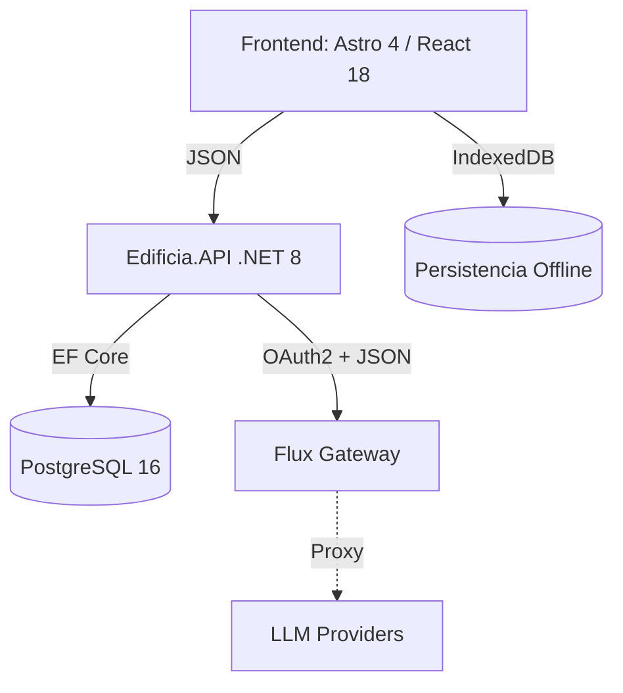

# **Diseño de Sistema (SDD) — EdificIA**

**Versión:** 3.0 (Actualizado con Frontend Implementado)

## **1. Arquitectura Lógica**

**Namespace Base:** Edificia.*



## **2. Arquitectura del Frontend**

### **2.1. Stack Tecnológico**

| Tecnología | Versión | Propósito |
| :--- | :--- | :--- |
| Astro | 4.x | SSR, rutas .astro, layouts |
| React | 18.x | Componentes interactivos (client:load) |
| TypeScript | 5.x | Tipado estricto |
| Tailwind CSS | 4.0-alpha | Estilos utilitarios, tema oscuro premium |
| Zustand | 4.x | Estado global (Auth, Editor) |
| Zod | 3.x | Validación de esquemas |
| react-hook-form | 7.x | Gestión de formularios |
| TipTap | 3.x | Editor de texto enriquecido |
| Vitest | 4.x | Testing unitario/integración |

### **2.2. Estructura de Directorios**

```
apps/web/src/
├── components/
│   ├── Admin/           # ProjectManagement, ProjectForm, ProjectRow, UserForm, UserRow
│   ├── Editor/          # EditorShell, EditorToolbar, SidebarNavigation
│   ├── Profile/         # ProfileView
│   ├── auth/            # AuthGuard, ForgotPassword
│   └── ui/              # Button, Input, Card, Badge (Atómicos)
├── layouts/             # Layout.astro
├── pages/
│   ├── index.astro          # Login
│   ├── dashboard.astro      # Dashboard de Proyectos
│   ├── profile.astro        # Perfil de Usuario
│   ├── forgot-password.astro
│   ├── admin/
│   │   ├── users.astro      # Gestión de Usuarios
│   │   └── projects.astro   # Gestión de Proyectos
│   └── projects/
│       └── [id].astro       # Editor de Memoria
├── store/
│   ├── useAuthStore.ts      # Token, usuario, login/logout
│   └── useEditorStore.ts    # Sección activa, contenido, guardado
├── tests/                   # Todos los tests centralizados
│   ├── setup.ts
│   ├── Button.test.tsx
│   ├── AuthGuard.test.tsx
│   ├── ForgotPassword.test.tsx
│   ├── ProfileView.test.tsx
│   ├── UserForm.test.tsx
│   ├── UserRow.test.tsx
│   ├── ProjectForm.test.tsx
│   └── useAuthStore.test.ts
└── lib/
    └── utils.ts             # cn() helper (clsx + tailwind-merge)
```

### **2.3. Patrón de Formularios**

Todos los formularios siguen el patrón `react-hook-form` + `zodResolver`:

1. Definir esquema Zod con mensajes en español.
2. Usar `useForm<T>({ resolver: zodResolver(schema) })`.
3. Renderizar `{errors.field && <p>{errors.field.message}</p>}`.

**Regla de orden:** `.min(1, 'obligatorio')` antes de `.email('formato')` para priorizar mensajes.

## **3. Configuración de Infraestructura (.NET)**

El appsettings.json gestionará la identidad de la aplicación frente a la pasarela.

```json
"FluxGateway": {
  "AuthUrl": "https://dashboard-flux.jesusjbriceno.dev/api/v1/auth/login",
  "ChatUrl": "https://dashboard-flux.jesusjbriceno.dev/api/v1/chat/completions",
  "ClientId": "EDIFICIA_PROD_01",
  "ClientSecret": "[SECRET_VAULT]"
}
```

## **4. Servicio de Infraestructura (FluxAiService)**

Este servicio en Edificia.Infrastructure debe implementar:

1. **Token Management:** Comprobar si existe token válido en caché. Si no, hacer Login.
2. **Resilience:** Usar Polly para reintentos si el Gateway devuelve 503 o 429.
3. **DTO Mapping:** Adaptar el formato de respuesta de Flux al formato interno de Edificia.

## **5. Modelo de Datos (Core)**

La entidad Project es el corazón del sistema.

```csharp
public class Project {
    public Guid Id { get; set; }
    public string Title { get; set; }
    // Estrategia
    public InterventionType Intervention { get; set; } // Obra Nueva, Reforma...
    public bool LoeExemption { get; set; } // Art 2.2
    // Datos
    public string ContentTreeJson { get; set; } // JSONB
}
```
