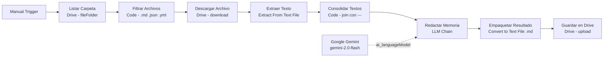

# Documentación del flujo n8n — Generador de la memoria (TFM) EdificIA

## Finalidad

- **Objetivo:** Automatizar la generación del borrador de la memoria del TFM del proyecto "EdificIA" a partir de la documentación de proyecto almacenada en Google Drive.
- **Resultado esperado:** Un archivo Markdown (`Borrador_Memoria_TFM_EdificIA.md`) con la estructura académica completa (Resumen, Introducción, Objetivos, Metodología, Desarrollo técnico, Conclusiones), generado por Google Gemini y subido automáticamente a Google Drive.

## Resumen del flujo (pipeline)

- **Manual Trigger:** Inicio manual del flujo.
- **Listar Carpeta (Google Drive):** Lista todos los ficheros de la carpeta fuente (`FOLDER_ID_EDIFICIA_MD`).
- **Filtrar Archivos (Code):** Filtra por extensión (`.md`, `.json`, `.yml`, `.yaml`) excluyendo carpetas.
- **Descargar Archivo (Google Drive):** Descarga el binario de cada fichero filtrado.
- **Extraer Texto (Extract From Text File):** Extrae el contenido textual del binario.
- **Consolidar Textos (Code):** Une todos los textos con separador `---`, produciendo `documentacion_completa`.
- **Redactar Memoria (LLM Chain):** Envía la documentación consolidada a Google Gemini con el prompt académico; genera el borrador con la estructura requerida.
- **Google Gemini:** Modelo `gemini-2.0-flash` conectado como `ai_languageModel` al nodo anterior.
- **Empaquetar Resultado (Convert to Text File):** Empaqueta la respuesta del LLM como archivo `.md`.
- **Guardar en Drive (Google Drive):** Sube `Borrador_Memoria_TFM_EdificIA.md` a la carpeta destino (`FOLDER_ID_MASTERDESARROLLO_IA`).

## Entradas, dependencias y supuestos

- **Carpeta origen:** Contiene la documentación del proyecto en formato `.md`, `.json`, `.yml` o `.yaml`.
- **Placeholders obligatorios:** Reemplazar antes de ejecutar:
  - `FOLDER_ID_EDIFICIA_MD` — ID de la carpeta Drive con la documentación fuente.
  - `FOLDER_ID_MASTERDESARROLLO_IA` — ID de la carpeta Drive donde se guardará el borrador.
- **Credenciales necesarias:** Google Drive (OAuth2) y Google Gemini configurados en n8n.

## Detalles técnicos relevantes

- **Nodos Code:** `typeVersion: 2`, modo `runOnceForAllItems` para procesar todos los items en una sola ejecución.
- **Google Drive:** `typeVersion: 3` para todos los nodos Drive.
- **Extract From Text File:** `typeVersion: 1`, lee la propiedad binaria `data`.
- **LLM Chain:** `@n8n/n8n-nodes-langchain.chainLlm`, conexión del modelo por `ai_languageModel` (no por `main`).
- **Prompt:** Obliga a usar únicamente la documentación provista; no modificar la restricción de fuentes sin revisión del alcance académico.

## Buenas prácticas y recomendaciones antes de ejecutar

- **Probar primero:** Ejecutar el nodo `Listar Carpeta` en modo prueba para verificar que la carpeta Drive devuelve ficheros.
- **Validar extensiones:** Asegurarse de que los ficheros a procesar tienen extensión `.md`, `.json`, `.yml` o `.yaml`.
- **Tamaño de contexto:** Si la documentación es muy extensa, considerar filtrar solo los ficheros más relevantes para no superar el límite de tokens del modelo.

## Cómo importar y ejecutar en n8n

1. Abrir n8n → `Import from JSON` → importar `workflow-tfm.json`.
2. Configurar las credenciales de Google Drive y Google Gemini en los nodos correspondientes.
3. Reemplazar los placeholders `FOLDER_ID_EDIFICIA_MD` y `FOLDER_ID_MASTERDESARROLLO_IA` en los nodos Drive con las IDs reales.
4. Ejecutar en modo prueba el nodo `Listar Carpeta` para validar la conexión y los resultados.
5. Lanzar el flujo completo con el `Manual Trigger` y revisar el archivo generado en la carpeta destino.

## Notas de mantenimiento

- Mantener actualizados los IDs de carpeta si cambian las ubicaciones en Drive.
- Si se amplía la documentación fuente, no es necesario modificar el flujo; el LLM procesará el texto agregado automáticamente.
- Cambios en la versión del modelo (p. ej. a `gemini-2.0-pro`) se aplican en el nodo `Google Gemini`.

## Archivos relacionados

- [`workflow-tfm.json`](../../apps/n8n/workflow-tfm.json) — definición del flujo importable en n8n.

---
## Diagrama del pipeline

