# Documentación del flujo n8n — Generador de la memoria y slides (TFM) EdificIA

## Finalidad

- **Objetivo:** Automatizar la generación del borrador de la memoria del TFM y del guión de diapositivas a partir de la documentación del proyecto almacenada en Google Drive.
- **Resultado esperado:**
  - `Borrador_Memoria_TFM_EdificIA.md` — memoria académica completa subida a Drive.
  - **Presentación Google Slides real** — 15 diapositivas creadas directamente en Google Slides mediante la API REST (`presentations.create` + `presentations.batchUpdate`), con espacios reservados para imágenes.

## Contexto del proyecto para el TFM

EdificIA es un **MVP escalable** diseñado como producto profesional y entregable académico. El objetivo del TFM es demostrar la viabilidad técnica de una solución que combina:

- **Arquitectura profesional:** Clean Architecture + CQRS en .NET 8, frontend Astro/React con Islands Architecture.
- **Integración IA delegada:** La generación de contenido se delega a flujos n8n (Flux Gateway o Google Gemini), intercambiables mediante variable de entorno (`AI_WEBHOOK_URL`), sin cambios en el código del backend.
- **Despliegue en producción:** Docker + Coolify v4 con Traefik, TLS automático y healthchecks.
- **Dominio específico:** Redacción automatizada de Memorias de Proyecto de Ejecución en España (CTE/LOE), discriminando entre Obra Nueva y Reforma.

El prompt del flujo instruye al modelo a reflejar tanto el **rigor académico** como la **solidez técnica** del producto, destacando la escalabilidad del diseño y su aplicabilidad real en el sector.

## Resumen del flujo (pipeline v9)

El flujo tiene **dos ramas secuenciales**: primero genera la memoria, después usa esa memoria para generar las slides.

### Rama 1 — Generación de la memoria

- **Manual Trigger:** Inicio manual del flujo.
- **Listar Carpeta (Google Drive):** Lista todos los ficheros de la carpeta fuente (`FOLDER_ID_EDIFICIA_MD`). **Incluye `CONTEXTO_TFM.md`** que debe estar en esa carpeta.
- **Filtrar Archivos (Code):** Filtra por extensión (`.md`, `.json`, `.yml`, `.yaml`) excluyendo carpetas.
- **Descargar Archivo (Google Drive):** Descarga el binario de cada fichero filtrado.
- **Extraer Texto (Extract From Text File):** Extrae el contenido textual del binario.
- **Consolidar Textos (Code):** Une todos los textos con separador `---`, produciendo `documentacion_completa`.
- **Redactar Memoria (LLM Chain):** Envía la documentación consolidada a Google Gemini con el prompt académico. El prompt incluye URL del repositorio, URL de producción y contexto sobre Flux Gateway. Genera el borrador con estructura académica + sección "Recursos" con los enlaces finales.
- **Google Gemini:** Modelo `gemini-2.0-flash` conectado como `ai_languageModel`.
- **Empaquetar Memoria (Convert to Text File):** Empaqueta la respuesta como `Borrador_Memoria_TFM_EdificIA.md`.
- **Guardar Memoria en Drive (Google Drive):** Sube el archivo a `FOLDER_ID_MASTERDESARROLLO_IA` y retorna el `webViewLink` del fichero.

### Rama 2 — Generación de las diapositivas

- **Preparar Contexto Slides (Code):** Extrae el `webViewLink` de la memoria recién subida y recupera el texto completo del nodo `Redactar Memoria` para pasarlo como contexto al prompt de slides.
- **Generar Guión Slides (LLM Chain):** Envía el texto de la memoria + URL + instrucciones de formato al modelo. Solicita UN array JSON de exactamente 15 objetos (sin markdown extra). El prompt especifica distribución fija de tipos: portada, 6×contenido, 4×imagen, cierre.
- **Google Gemini Slides:** Segunda instancia de `gemini-2.0-flash` para el pipeline de slides (nodo separado para independencia de configuración).
- **Parsear JSON Slides (Code):** Parsea la respuesta del LLM, limpia posibles bloques markdown y maneja errores de parseo devolviendo una slide de error en lugar de romper el flujo.
- **Construir Requests Slides (Code):** Para cada slide del JSON, genera los requests de la Google Slides API: `createSlide` (BLANK layout con objectId pre-asignado), `createShape` (TEXT_BOX título) + `insertText`, `createShape` (TEXT_BOX cuerpo) + `insertText`. Usa unidades EMU (1 inch = 914400 EMU). Diferencia portada (layout centrado) del resto (layout título arriba + cuerpo debajo). Salida: `{ requests: [...] }`.
- **Crear Presentación (HTTP Request):** `POST https://slides.googleapis.com/v1/presentations` con body `{"title": "EdificIA — Presentación TFM"}`. Autenticación `predefinedCredentialType → googleDriveOAuth2Api` (el scope `drive` cubre la Slides API). Retorna `{ presentationId, slides[0].objectId }`.
- **Ensamblar BatchUpdate (Code):** Combina el `presentationId` de la API con los requests construidos. Prepende `deleteObject` para eliminar la diapositiva en blanco creada por defecto. Salida: `{ presentationId, requests: [deleteBlankSlide, ...allSlideRequests] }`.
- **Aplicar a Google Slides (HTTP Request):** `POST https://slides.googleapis.com/v1/presentations/{presentationId}:batchUpdate` con todos los requests. Misma autenticación Drive OAuth2. El resultado es la presentación de Google Slides completamente generada, accesible en Google Drive.

## Entradas, dependencias y supuestos

- **Carpeta origen (`FOLDER_ID_EDIFICIA_MD`):** Debe contener la documentación del proyecto en formato `.md`, `.json`, `.yml` o `.yaml`. **Obligatorio:** incluir `CONTEXTO_TFM.md` (ubicado en `docs/TFM/`) para que el flujo tenga acceso al desglose de vistas, información de Flux Gateway, URLs del proyecto e instrucciones específicas del prompt.
- **Placeholders obligatorios:** Reemplazar antes de ejecutar:
  - `FOLDER_ID_EDIFICIA_MD` — ID de la carpeta Drive con la documentación fuente.
  - `FOLDER_ID_MASTERDESARROLLO_IA` — ID de la carpeta Drive donde se guardarán los archivos generados.
- **Credenciales necesarias:** Google Drive (OAuth2) y Google Gemini configurados en n8n.
- **Assets de imagen:** La presentación Google Slides se crea con texto de marcador `[IMAGEN: img_0X.png]` en las slides de tipo `imagen`. Las capturas reales se insertan **manualmente** desde la interfaz de Google Slides. Ver sección 7 de `CONTEXTO_TFM.md` para la lista completa de imágenes.
- **Google Slides API:** No requiere credenciales adicionales. El scope `drive` del credential existente `googleDriveOAuth2Api` cubre `https://www.googleapis.com/auth/presentations`.

## Detalles técnicos relevantes

- **Nodos Code:** `typeVersion: 2`, modo `runOnceForAllItems`.
- **Google Drive:** `typeVersion: 3` en todos los nodos Drive.
- **Extract From Text File:** `typeVersion: 1`, lee la propiedad binaria `data`.
- **LLM Chain (memoria):** `@n8n/n8n-nodes-langchain.chainLlm`, conexión por `ai_languageModel`. El nodo `Redactar Memoria` almacena su respuesta en `.json.text`, que el nodo `Preparar Contexto Slides` recupera con `$('Redactar Memoria').first().json.text`.
- **LLM Chain (slides):** Segundo pipeline LLM independiente con su propia instancia de `Google Gemini Slides`. Permite configurar credenciales o modelos distintos para cada fase.
- **Parseo robusto:** `Parsear JSON Slides` limpia posibles bloques ` ```json ``` ` que el LLM añada y maneja fallos sin romper el flujo.
- **Google Slides API — dos llamadas:** (1) `POST /v1/presentations` crea la presentación en blanco y devuelve `presentationId` + objectId de la slide inicial. (2) `POST /v1/presentations/{id}:batchUpdate` recibe todos los requests en una sola llamada, incluyendo `deleteObject` para la slide en blanco inicial.
- **objectIds pre-asignados:** Los IDs de slides y shapes se generan con patrón `slide_N / title_N / body_N` en el nodo `Construir Requests Slides`, antes de la llamada API. Esto permite construir todo el payload de una vez sin necesidad de conocer los IDs que devolvería la API.
- **Unidades EMU:** Todas las posiciones y tamaños en la API de Slides se expresan en EMU (English Metric Units). 1 pulgada = 914400 EMU. El slide 16:9 mide 9144000 × 5143500 EMU.
- **webViewLink:** `Guardar Memoria en Drive` devuelve el objeto del fichero; `Preparar Contexto Slides` extrae `webViewLink` para incluirlo en la slide de cierre.

## Buenas prácticas y recomendaciones antes de ejecutar

- **Subir `CONTEXTO_TFM.md` a Drive:** Es el fichero auxiliar con toda la información adicional (vistas, Flux Gateway, URLs, instrucciones de prompt). Sin él, el flujo pierde contexto clave.
- **Probar primero:** Ejecutar el nodo `Listar Carpeta` en modo prueba para verificar que la carpeta Drive devuelve ficheros incluyendo `CONTEXTO_TFM.md`.
- **Validar extensiones:** Los ficheros a procesar deben tener extensión `.md`, `.json`, `.yml` o `.yaml`.
- **Tamaño de contexto:** Si la documentación es muy extensa, el prompt de slides trunca el texto de la memoria a 8.000 caracteres. Considerar filtrar solo los ficheros más relevantes si se supera el límite de tokens del modelo.
- **Imágenes de la aplicación:** Preparar las 6 capturas indicadas en `CONTEXTO_TFM.md` (sección 7) antes de importar el guión a Google Slides / PowerPoint / Canva.

## Cómo importar y ejecutar en n8n

1. Abrir n8n → `Import from JSON` → importar `workflow-tfm.json`.
2. Configurar las credenciales de Google Drive y Google Gemini en los nodos correspondientes (tanto `Google Gemini` como `Google Gemini Slides`).
3. Reemplazar los placeholders `FOLDER_ID_EDIFICIA_MD` y `FOLDER_ID_MASTERDESARROLLO_IA` en los nodos Drive con las IDs reales.
4. **Subir `docs/TFM/CONTEXTO_TFM.md` a la carpeta `FOLDER_ID_EDIFICIA_MD`** en Google Drive.
5. Ejecutar en modo prueba el nodo `Listar Carpeta` para validar la conexión y verificar que aparece `CONTEXTO_TFM.md` entre los ficheros.
6. Lanzar el flujo completo con el `Manual Trigger`. Se generarán:
   - `Borrador_Memoria_TFM_EdificIA.md` en Drive.
   - Una presentación **Google Slides real** accesible directamente desde Google Drive.
7. Abrir la presentación en Google Slides e insertar manualmente las 6 capturas de pantalla en las slides de tipo imagen (ver sección 7 de `CONTEXTO_TFM.md`).

## Notas de mantenimiento

- Mantener actualizados los IDs de carpeta si cambian las ubicaciones en Drive.
- Si se amplía la documentación fuente, no es necesario modificar el flujo; el LLM procesará el texto agregado automáticamente.
- `CONTEXTO_TFM.md` es el punto centralizado para ajustar el contexto del proyecto, las instrucciones del prompt, las URLs y el desglose de vistas. Cualquier cambio de contexto debe hacerse ahí, no en el workflow.
- Cambios en el modelo (p. ej. a `gemini-2.0-pro`) se aplican en los nodos `Google Gemini` y `Google Gemini Slides`.
- Si el LLM de slides devuelve JSON malformado repetidamente, revisar el prompt del nodo `Generar Guión Slides` o cambiar a un modelo con mayor capacidad de seguir instrucciones de formato.
- Si la llamada a `Aplicar a Google Slides` falla con 403, verificar que el credential `googleDriveOAuth2Api` en n8n tiene el scope `https://www.googleapis.com/auth/drive` (o `presentations`) habilitado.

## Archivos relacionados

- [`workflow-tfm.json`](../../apps/n8n/workflow-tfm.json) — definición del flujo importable en n8n.
- [`CONTEXTO_TFM.md`](CONTEXTO_TFM.md) — fichero auxiliar con contexto del proyecto, desglose de vistas, instrucciones de prompt e inventario de imágenes. **Debe subirse a `FOLDER_ID_EDIFICIA_MD` en Google Drive.**

---
## Diagrama del pipeline

```mermaid
flowchart LR
  A[Manual Trigger] --> B[Listar Carpeta\nDrive - fileFolder]
  B --> C[Filtrar Archivos\nCode - .md .json .yml]
  C --> D[Descargar Archivo\nDrive - download]
  D --> E[Extraer Texto\nExtract From Text File]
  E --> F[Consolidar Textos\nCode - join con ---]
  F --> G[Redactar Memoria\nLLM Chain]
  H[Google Gemini\ngemini-2.0-flash] -. ai_languageModel .-> G
  G --> I[Empaquetar Memoria\nConvert to Text File .md]
  I --> J[Guardar Memoria en Drive\nDrive - upload]
  J --> K[Preparar Contexto Slides\nCode - extrae texto + URL]
  K --> L[Generar Guión Slides\nLLM Chain - JSON 15 slides]
  M[Google Gemini Slides\ngemini-2.0-flash] -. ai_languageModel .-> L
  L --> N[Parsear JSON Slides\nCode - limpia + parsea]
  N --> O[Construir Requests Slides\nCode - EMU, objectIds]
  O --> P[Crear Presentación\nHTTP POST slides API]
  P --> Q[Ensamblar BatchUpdate\nCode - deleteBlank + requests]
  Q --> R[Aplicar a Google Slides\nHTTP POST batchUpdate]
```


