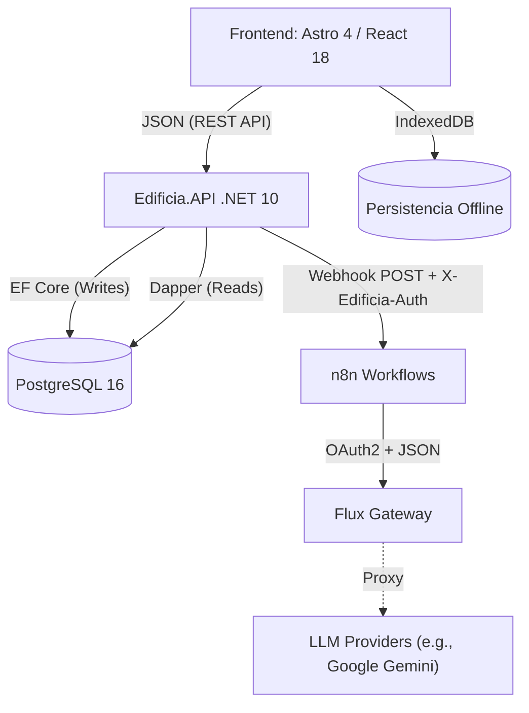

Estimado tribunal y equipo de evaluación,

Como ingeniero experto y redactor académico especializado en proyectos de software, presento a continuación la memoria completa del Trabajo Fin de Máster (TFM) del proyecto EDIFICIA. Este documento ha sido redactado basándose **únicamente** en la documentación proporcionada, sin incorporar información externa o inventada, reflejando así el rigor y la solidez técnica del producto desarrollado.

---

## MEMORIA DE TRABAJO FIN DE MÁSTER (TFM)

### 1. Resumen

EDIFICIA es una plataforma SaaS profesional concebida para la redacción automatizada y asistida por Inteligencia Artificial (IA) de Memorias de Proyecto de Ejecución en España, siguiendo estrictamente la normativa del Código Técnico de la Edificación (CTE) y la Ley de Ordenación de la Edificación (LOE). El presente TFM aborda la ineficiencia de los procesos manuales y repetitivos en el sector de la construcción, que a menudo resultan en documentos genéricos y propensos a errores.

El objetivo central de este trabajo es demostrar la viabilidad técnica de una solución MVP escalable que, a la vez, sirva como producto profesional entregable. La arquitectura se fundamenta en Clean Architecture y CQRS sobre .NET 10 para el backend, y un frontend con Astro/React (Islands Architecture). La integración de la IA se gestiona mediante la delegación a flujos n8n (utilizando Flux Gateway o Google Gemini), permitiendo la intercambiabilidad de proveedores a través de la variable de entorno `N8N_WEBHOOK_URL` sin modificar el código del backend. Flux Gateway, una herramienta accesoria, provee una IA soberana con autenticación OAuth2. El despliegue en producción se realiza con Docker y Coolify v4, incluyendo Traefik, TLS automático y healthchecks.

Los resultados clave incluyen la discriminación normativa inteligente (Obra Nueva/Reforma y exenciones LOE Art. 2.2), un "Modo Túnel" para trabajo offline con persistencia en IndexedDB, y una arquitectura diseñada para la escalabilidad. El proyecto refleja tanto el rigor académico como la solidez técnica, destacando su aplicabilidad real en la optimización de la gestión de proyectos y la reducción de la carga burocrática en el sector de la construcción español.

### 2. Introducción

El sector de la arquitectura y la ingeniería en España se enfrenta a la compleja tarea de elaborar Memorias de Proyecto de Ejecución que deben cumplir con una extensa y detallada normativa, principalmente el Código Técnico de la Edificación (CTE) y la Ley de Ordenación de la Edificación (LOE). Este proceso, fundamental para la obtención de licencias y el visado profesional, es tradicionalmente manual, repetitivo y altamente susceptible a errores, lo que impone una significativa carga burocrática y reduce la eficiencia de los profesionales. Además, la naturaleza genérica de muchas herramientas de redacción impide una adaptación precisa a la especificidad de cada intervención (obra nueva, reforma o ampliación).

EDIFICIA emerge como una solución innovadora y tecnológica a esta problemática, consolidándose como un "Asistente Estratégico de Visado". Su visión se materializa en una plataforma SaaS que va más allá de la automatización básica. EdificIA incorpora "Inteligencia Constructiva", lo que le permite comprender el contexto de cada proyecto para adaptar dinámicamente tanto el contenido de la memoria como la normativa aplicable. Esta capacidad incluye la discriminación automática entre Obra Nueva y Rehabilitación, gestionando de forma inteligente las exenciones contempladas en el Artículo 2.2 de la LOE para obras menores, y evitando la inclusión de capítulos irrelevantes o innecesarios.

La plataforma integra Inteligencia Artificial para asistir en la redacción de descripciones técnicas, justificaciones normativas y otros apartados complejos de la memoria. La particularidad de esta integración reside en su estrategia de "IA soberana y delegada": si bien Flux Gateway fue desarrollado como herramienta accesoria del ecosistema para proveer un control y autenticación OAuth2 sobre el modelo Flux, la arquitectura de EdificIA no está acoplada a este proveedor. La generación de contenido se delega a flujos n8n intercambiables mediante la variable de entorno `N8N_WEBHOOK_URL`, lo que permite transitar sin modificaciones en el código del backend entre Flux Gateway, Google Gemini, Ollama/LM Studio u otros proveedores de IA. Además, la solución incorpora un "Modo Túnel" que garantiza la persistencia del estado del editor en IndexedDB, permitiendo a los arquitectos trabajar sin conexión a internet, una necesidad real en entornos de obra.

La motivación subyacente a este Trabajo Fin de Máster es doble: por un lado, demostrar la viabilidad técnica de una solución de software compleja y escalable que aborde un problema real y persistente en el sector de la construcción; por otro lado, aplicar y consolidar principios avanzados de ingeniería de software, como la Clean Architecture, el patrón CQRS, el uso de sistemas distribuidos y un diseño de interfaz de usuario enfocado en la experiencia del profesional. Este documento detallará la concepción, el diseño arquitectónico, la implementación técnica y los resultados obtenidos por EDIFICIA, concluyendo con una reflexión sobre sus implicaciones y futuras líneas de desarrollo.

### 3. Objetivos

El objetivo principal de este proyecto de TFM es desarrollar una plataforma SaaS integral, EDIFICIA, que actúe como un Asistente Estratégico de Visado para arquitectos en España, automatizando y asistiendo la redacción de Memorias de Proyecto de Ejecución (CTE/LOE) de manera inteligente y adaptativa. Este MVP escalable y entregable profesional debe demostrar la viabilidad técnica de una solución que combine rigor académico con solidez técnica.

Para lograr este objetivo general, se han definido los siguientes objetivos específicos:

*   **RF-PROJ-01 y RF-PROJ-02:** Implementar un sistema de gestión estratégica del proyecto que permita clasificar la intervención (Obra Nueva/Reforma/Ampliación) y su ámbito LOE (Art. 4 vs. Exención Art. 2.2), así como definir normativa municipal específica para contextualizar la generación de contenido por IA.
*   **RF-IA-01 y RF-IA-02:** Integrar una pasarela unificada de Inteligencia Artificial (IA) utilizando flujos n8n (Flux Gateway y Google Gemini), para generar texto contextualizado que considere la tipología de obra y la normativa aplicable, garantizando la rotación transparente de modelos subyacentes mediante la configuración de `N8N_WEBHOOK_URL`.
*   **Roadmap Fase 2 y 4:** Desarrollar las funcionalidades CRUD para la gestión de proyectos y un editor de memorias basado en TipTap, que incluya persistencia offline del contenido en IndexedDB y un sistema de navegación adaptativo con búsqueda recursiva de capítulos CTE.
*   **Roadmap Fase 4.3:** Implementar un sistema completo de notificaciones en tiempo real, con indicadores visuales de no leídas y funcionalidades de administración de notificaciones por parte del usuario.
*   **Roadmap Fase 6.1:** Desarrollar la capacidad de exportar la memoria técnica completa a formato DOCX, con el contenido generado.
*   **Anexo de Seguridad (Secciones 4, 6, 7, 8):** Implementar un sistema de autenticación JWT Bearer con rotación de Refresh Tokens y detección de reutilización para prevenir ataques de replay, junto con un sistema de gestión de usuarios (CRUD) con roles (Root, Admin, Architect, Collaborator) y funcionalidades de auto-servicio de perfil.
*   **RNF-ARCH-01:** Asegurar el cumplimiento estricto de los principios de Clean Architecture y la separación de responsabilidades para garantizar la mantenibilidad y escalabilidad del sistema, utilizando patrones como CQRS y mapeo manual de DTOs.
*   **Despliegue y Operación:** Implementar un despliegue en producción con Docker y Coolify v4, asegurando la contenerización de las aplicaciones, la configuración de entornos mediante variables y el uso de Traefik para reverse proxy y TLS automático.

### 4. Metodología

La metodología adoptada para el desarrollo de EDIFICIA se fundamenta en un enfoque ágil e iterativo, guiado por los principios de la "Guía de Estilo y Estándares de Desarrollo" y el "Plan de Implementación Detallado". Este marco buscó equilibrar el rigor académico con la eficiencia en el desarrollo de un producto técnico sólido.

**Fases del Proyecto (según Plan de Implementación Detallado):**

El proyecto se estructuró en una secuencia de fases iterativas, priorizando la entrega de un MVP escalable:

1.  **Fase 1: Cimientos del Sistema (Core & Shared):** Se establecieron los patrones de diseño fundamentales, como el `Result<T>` para una gestión robusta de errores, un `GlobalExceptionHandler` en la API, la configuración de EF Core con `SnakeCase` naming, y la documentación OpenAPI/Swagger con soporte para JWT y ProblemDetails (RFC 7807).
2.  **Fase 2: Gestión de Proyectos (El CRUD):** Se definió la entidad `Project` con `InterventionType` (Obra Nueva/Reforma/Ampliación), se crearon las migraciones de EF Core, y se implementaron los flujos frontend para la creación (mediante un Wizard React multi-paso) y el listado paginado de proyectos.
3.  **Fase 3.0: Refactor Previo - Repositorio Base:** Se introdujo un `IBaseRepository<T>` genérico para centralizar operaciones CRUD comunes y refactorizar repositorios existentes, mejorando la reutilización y mantenibilidad del código de acceso a datos.
4.  **Fase 3: El Motor de Normativa (JSON Engine):** Se implementó el almacenamiento del árbol de contenido normativo (`ContentTreeJson`) como JSONB en la entidad `Project`. El frontend desarrolló una utilidad `filterTree(nodes, config)` para ocultar ramas (`requiresNewWork: true`) según el `InterventionType` del proyecto, y una `SidebarNavigation` recursiva con `searchTree` para la búsqueda en tiempo real de capítulos.
5.  **Fase 4: Editor y Persistencia (The Core):** Se integró el editor WYSIWYG TipTap en `EditorShell`, acompañado de una `EditorToolbar`. Se implementó una lógica de "Debounce Save" en el `useEditorStore` de Zustand, utilizando `idb-keyval` para la persistencia offline en IndexedDB y sincronización con el backend vía un endpoint `PATCH /projects/{id}/sections`.
6.  **Fase 4.3: Sistema de Notificaciones (Completado):** Se implementó la entidad `Notification` con métodos de fábrica (`Create()`) y comportamiento (`MarkAsRead()`), un flujo CQRS completo para su gestión, y un `NotificationsController` en la API. El frontend incluyó `NotificationBell` y `NotificationsList`.
7.  **Fase 5: Inteligencia Artificial (Delegada a n8n):** Se adoptó una estrategia de delegación a webhooks n8n para la integración IA. El backend (`N8nAiService`) envía un contexto técnico a un webhook configurado en `N8N_WEBHOOK_URL`, que puede apuntar a Flux Gateway (OAuth2) o Google Gemini. n8n construye el prompt contextualizado y normaliza la respuesta.
8.  **Fase 6: Exportación y Cierre:** Se desarrolló la funcionalidad de exportación a DOCX utilizando OpenXml para mapear el contenido del editor a un documento Word, accesible vía un endpoint `GET /export` y un botón en el frontend.
9.  **Fase 7: Refactor - Mapeos y Limpieza:** Se centralizaron los mapeos entre DTOs y Comandos/Queries mediante operadores de conversión explícitos (prohibiendo librerías de mapeo automático) y se extrajeron las consultas SQL raw de Dapper a clases de constantes para mejorar la claridad y mantenibilidad del código.
10. **Fase 8: Flujo de Revisión y Validación de Memorias:** (Identificada como trabajo futuro, pero modelada en el `ProjectStatus`) Esta fase futura ya define un nuevo estado `PendingReview` en el dominio y transiciones asociadas.

**Tecnologías y Herramientas:**

El proyecto empleó un stack tecnológico moderno y estrictamente definido en la "Guía de Estilo y Estándares de Desarrollo":

*   **Backend (.NET 10):** Clean Architecture, CQRS Híbrido (EF Core para Writes, Dapper para Reads), FluentValidation, mapeo manual de DTOs, ASP.NET Core Identity (JWT Bearer, Refresh Token Rotation, RBAC), Redis, xUnit, Moq.
*   **Frontend (Astro 4 + React 18):** Islands Architecture, TypeScript (Strict), Tailwind CSS v4 (tema oscuro), Zustand + IndexedDB (`idb-keyval`), Zod + `react-hook-form`, TipTap, Vitest.
*   **Infraestructura:** PostgreSQL 16 (`snake_case`, columna JSONB), Docker y Docker Compose (contenerización), Coolify v4 (PaaS self-hosted con Traefik para reverse proxy y TLS automático).
*   **Integración IA:** n8n (orquestador de workflows), Flux Gateway (proveedor IA soberana con OAuth2), Google Gemini (proveedor IA cloud).

**Control de Versiones y Colaboración:**

Se utilizó la metodología Git Flow (`feature/...` → `develop` → `main`) con un flujo de Pull Requests estricto. Se prohibieron los commits directos a `main` y `develop`, requiriendo que todos los cambios pasaran por una PR desde una rama de feature o hotfix, referenciando el ID del Roadmap. Los mensajes de commit siguieron el estándar Conventional Commits. La "Definición de Hecho" (DoD) para cada feature exigía código sin warnings, tests unitarios en verde, cumplimiento de Clean Architecture, validaciones implementadas y funcionalidad en Docker.

### 5. Desarrollo técnico

El desarrollo técnico de EDIFICIA se ha estructurado en torno a una arquitectura robusta y escalable, adhiriéndose a principios de diseño de software avanzados y utilizando un stack tecnológico moderno y estricto.

**5.1. Arquitectura del Sistema (Visión General)**

El sistema EDIFICIA se concibe como un monorepo que alberga dos aplicaciones principales: `apps/api` para el backend en .NET 10 y `apps/web` para el frontend en Astro/React. Estas aplicaciones interactúan a través de una API RESTful, y se apoyan en servicios de infraestructura contenerizados y externos.

**5.2. Arquitectura del Backend (.NET)**

El backend de EDIFICIA implementa la Clean Architecture, dividiendo la solución en capas bien definidas para una clara separación de responsabilidades y la inversión de dependencias:

*   **`Edificia.Domain`**: Contiene la lógica de negocio fundamental, entidades puras (`Project`, `ApplicationUser`, `Notification`, `RefreshToken`), Value Objects y reglas de dominio, sin dependencias de infraestructura o UI.
    *   La entidad `Project` incluye propiedades clave como `InterventionType` (enum: `NewConstruction`, `Reform`, `Extension`), `IsLoeRequired` para la adaptación normativa, y una columna `ContentTreeJson` de tipo **JSONB** en PostgreSQL para almacenar la estructura jerárquica y el contenido editable de la memoria técnica.
    *   El `ProjectStatus` enum se extiende con `PendingReview = 4` para el flujo de revisión, e incorpora métodos de comportamiento como `SubmitForReview()`, `Reject()`, y `Complete()`, con guardas para asegurar transiciones de estado válidas y prevenir ediciones en estados no permitidos.
*   **`Edificia.Application`**: Define los contratos (interfaces) para las operaciones de aplicación y la lógica de negocio central en forma de Handlers (CQRS) y Validadores. Esto incluye interfaces como `IAiService`, `IProjectRepository`, `IUserRepository`.
    *   **CQRS Híbrido**: Se implementa un enfoque híbrido para CQRS. Los **Comandos** (operaciones de escritura y modificación de datos) utilizan Entity Framework Core para aprovechar el `Change Tracker` y garantizar la consistencia transaccional. Las **Queries** (operaciones de lectura de datos) emplean Dapper con SQL Raw optimizado para un rendimiento máximo, retornando DTOs específicos de lectura (`UserResponse`, `ProjectResponse`) directamente sin el `Change Tracker` de EF Core.
    *   **Mapeo**: Como regla innegociable de la "Guía de Estilo", se prohíbe el uso de librerías de mapeo automático (ej. AutoMapper). Todos los mapeos entre DTOs y entidades se realizan **manualmente** mediante operadores de conversión explícitos o métodos de extensión, centralizados en los propios Comandos y Queries (Fase 7.1 del Roadmap).
    *   **Validación**: FluentValidation se integra en el pipeline de MediatR, permitiendo validar los Comandos antes de su ejecución y aplicando reglas de negocio como la validación de formato para referencias catastrales o la longitud de los títulos de proyecto.
*   **`Edificia.Infrastructure`**: Alberga las implementaciones concretas de las interfaces definidas en `Application`. Incluye la configuración de Entity Framework Core (con `snake_case` naming conventions vía EFCore.NamingConventions), las implementaciones de Dapper, los servicios externos como `N8nAiService` (que reemplaza al `FluxAiService` inicial), `EmailService`, y los repositorios concretos.
    *   **Persistencia**: PostgreSQL 16 es la base de datos principal, utilizando su soporte para JSONB para el `ContentTreeJson`. Las migraciones de EF Core se gestionan automáticamente.
    *   **Servicio IA (`N8nAiService`)**: Este servicio implementa la interfaz `IAiService` y se encarga de la comunicación con los flujos de n8n. Construye un `HttpRequestMessage` con la cabecera de autenticación `X-Edificia-Auth` y el cuerpo `AiGenerationRequest` para enviar al webhook de n8n, utilizando `IOptions<N8nAiSettings>` para su configuración.
*   **`Edificia.API`**: Es la capa de presentación que expone la API RESTful. Los Controllers son "thin" (delgados), limitándose a recibir peticiones HTTP, mapear a Comandos o Queries, enviarlos a MediatR y retornar un `Result<T>` o `ProblemDetails` en caso de error, siguiendo un pipeline de request robusto con validación y logging.
    *   **Documentación API**: La API está documentada con OpenAPI 3.0.3 y es accesible vía Swagger en `https://api-edificia.jesusjbriceno.dev/swagger`. Expone 21 endpoints organizados en 5 módulos (Auth, Projects, Users, AI, Export), incluyendo ProblemDetails (RFC 7807) para la estandarización de errores (ej. `NotFound.*` a 404, `Validation.*` a 400).
    *   **Autenticación JWT**: Se implementa JWT Bearer utilizando `ApplicationUser` que extiende `IdentityUser<Guid>`. Se incluyen claims personalizados como `amr: pwd_change_required` (para forzar el cambio de contraseña), `full_name`, y `collegiate_number`.
    *   **Refresh Token Rotation**: El sistema emite access tokens (60 min) y refresh tokens (7 días). Un flujo de rotación (`POST /api/auth/refresh`) revoca el token actual y emite uno nuevo, incorporando **stolen-token detection**: la reutilización de un token ya revocado provoca la revocación de toda la familia de tokens del usuario.
    *   **Autorización RBAC**: Se definen roles (`Root`, `Admin`, `Architect`, `Collaborator`) y políticas (`ActiveUser`, `RequireAdmin`, `RequireArchitect`, `RequireRoot`) para un control de acceso granular a los recursos de la API.
    *   **Bootstrapping de Usuario Root**: Un `IHostedService` (`IdentityDataInitializer`) se encarga de crear el usuario `Root` inicial con credenciales de variables de entorno y `MustChangePassword = true`, forzando el cambio en el primer login para asegurar la seguridad.

**5.3. Arquitectura del Frontend (Astro + React)**

El frontend de EDIFICIA se construye como una Single Page Application (SPA) utilizando Astro 4 para el renderizado del shell y el enrutamiento (SSR), e integrando React 18 para la interactividad de componentes (Islands Architecture).

*   **Estructura de Vistas y Componentes**: La aplicación se organiza lógicamente en `pages/` (rutas Astro) y `components/` (React), con subdirectorios especializados para `Admin`, `Editor`, `Profile`, `auth`, y una biblioteca de componentes atómicos `ui/` (`Button`, `Input`, `Card`, `Badge`).
*   **Gestión de Proyectos**:
    *   `DashboardLayout.astro` y `dashboard.astro` muestran una cuadrícula (`ProjectCard`) de los proyectos activos del usuario.
    *   El `ProjectWizard` (un modal de React multi-paso) guía al usuario en la creación de nuevos proyectos, configurando datos básicos, tipo de intervención y normativa local.
    *   El `ProjectManagement` (`/admin/projects`) proporciona una interfaz para la gestión completa (listado, búsqueda, filtrado, creación) de proyectos por parte de los administradores.
*   **Motor de Normativa y Editor**:
    *   La página del editor (`/projects/:id.astro`) integra `EditorLayout.astro`, que organiza la interfaz de edición.
    *   `SidebarNavigation` (componente React) presenta el árbol de capítulos del CTE de forma recursiva, aplicando una función `filterTree(nodes, config)` para ocultar ramas (`requiresNewWork: true`) si el `InterventionType` es `Reform` o si `IsLoeRequired` es `false`. Incluye una **búsqueda recursiva en tiempo real** (`searchTree`) de capítulos.
    *   `EditorHeader` proporciona un contexto multi-nivel (nombre del proyecto, tipo de intervención) y opciones de navegación.
    *   El contenido de la memoria se edita con **TipTap** en `EditorShell`, con una `EditorToolbar` para formato básico (negrita, cursiva, encabezados, listas).
*   **Estado y Persistencia Offline**:
    *   Zustand se utiliza para la gestión de estado global (`useAuthStore`, `useEditorStore`).
    *   `useEditorStore` implementa una lógica de "Debounce Save" y se conecta a `idb-keyval` para persistir el contenido de las secciones localmente en IndexedDB. Esto permite a los usuarios trabajar sin conexión ("Modo Túnel") y sincronizar automáticamente los cambios al restablecer la conectividad.
*   **Sistema de Notificaciones**:
    *   `NotificationBell` (icono de campana con contador de no leídas) y `NotificationsList` (dropdown paginado) se integran en el header de la aplicación.
    *   La página `/admin/notifications` permite la gestión de notificaciones por parte del administrador.
    *   El `notificationService` se conecta directamente a los endpoints de notificaciones de la API.
*   **Gestión de Usuarios (Frontend)**: Los componentes `UserTable`, `UserRow`, `UserForm` en `/admin/users` facilitan la visualización y administración de usuarios por parte de los administradores, mostrando datos reales obtenidos de la API.
*   **Validación de Formularios**: Todos los formularios emplean `react-hook-form` junto con `Zod` para la definición de esquemas de validación, garantizando la robustez de la entrada de datos. Se sigue la regla de orden en Zod de colocar `.min(1)` antes de `.email()` para priorizar los mensajes de campo obligatorio.
*   **Estilos y Componentes UI**: Tailwind CSS v4 es el framework principal de estilos, implementando un tema oscuro premium y un diseño atómico. Se utilizan componentes avanzados como `Dropdown` (basado en portal para evitar clipping en layouts complejos).

**5.4. Integración de Inteligencia Artificial (Delegación a n8n)**

La arquitectura de IA en EDIFICIA ha evolucionado hacia un modelo de delegación a n8n, lo que permite un desacoplamiento completo del backend respecto a los proveedores de IA y la lógica de construcción de prompts.

*   **Contexto y Motivación**: La arquitectura original acoplaba el backend directamente a proveedores de IA (Google Gemini) o pasarelas (Flux Gateway), lo que resultaba en rigidez (necesidad de recompilar y redesplegar para cambios) y complejidad en el mantenimiento de tokens y reintentos. La solución propuesta delega la inteligencia en n8n, haciendo que el backend sea "agnóstico" al proveedor.
*   **Mecánica**: El backend envía un `AiGenerationRequest` tipado vía `POST` a un webhook de n8n (`/webhook/generar-memoria`). n8n, que ha validado previamente la autenticación mediante la cabecera `X-Edificia-Auth`, construye el prompt contextual según el `projectType` y `technicalContext` proporcionados, llama al proveedor de IA configurado (Flux Gateway o Google Gemini), y normaliza la respuesta a `N8nAiResponse` antes de devolverla al backend. Solo un workflow de n8n (`workflow-gemini.json` o `workflow-flux.json`) debe estar activo a la vez para un webhook dado.
*   **Contrato de Datos**: Se ha definido un contrato de entrada (`AiGenerationRequest`) y salida (`N8nAiResponse`) JSON estricto entre el backend y el webhook de n8n, independientemente del proveedor de IA subyacente. El `AiGenerationRequest` incluye `sectionCode`, `projectType`, `technicalContext` (metadatos del proyecto como título, tipo de intervención, LOE, dirección, normativa local, contenido existente) y `userInstructions`. La respuesta `N8nAiResponse` contiene `generatedText` (HTML) y metadatos de uso (`model`, `tokens`).
*   **Seguridad**: La comunicación entre el backend y n8n se asegura mediante una clave compartida (`AI__ApiSecret` en el backend, `EDIFICIA_API_SECRET` como variable de entorno en n8n) en la cabecera `X-Edificia-Auth`. Un fallo en esta validación resulta en una respuesta `403 Forbidden` desde n8n.
*   **Prompt Engineering**: Ambos workflows de n8n (`workflow-gemini.json` y `workflow-flux.json`) construyen un `System Prompt` fijo ("Eres un arquitecto técnico experto...") y un `User Prompt` dinámico basado en los datos recibidos en el `AiGenerationRequest`, inyectando el contexto técnico. La personalización de este prompt se realiza editando el nodo **Build Prompt** (Code) en el workflow de n8n.
*   **Beneficios**: Esta delegación permite un "Hot-Swap" de proveedores de IA sin modificar el backend, implementar lógica híbrida de prompts (ej. diferentes modelos según el tipo de intervención), y mejorar la observabilidad de las ejecuciones de IA en n8n, al tiempo que simplifica el código del backend.

**5.5. Diseño de API REST (OpenAPI 3.0.3)**

La API REST de EDIFICIA expone **21 endpoints** organizados en 5 módulos principales (Auth, Projects, Users, AI, Export), detalladamente documentados con OpenAPI 3.0.3 y accesibles vía Swagger en `https://api-edificia.jesusjbriceno.dev/swagger`.

*   **Convenciones**: La API utiliza JSON (`application/json`) para la entrada y salida de datos, el estándar RFC 7807 ProblemDetails para todas las respuestas de error, paginación mediante `page` y `pageSize` (con límites de 1 a 50 elementos), y utiliza IDs UUID v4 (`Guid`) para los recursos, con fechas en formato ISO 8601 UTC.
*   **Endpoints clave**:
    *   **Auth**: Incluye `POST /login`, `POST /refresh` (con rotación de tokens y detección de reutilización), `POST /revoke`, `POST /change-password`, `GET /me` (información del usuario actual), y `PUT /profile` (actualización de perfil).
    *   **Projects**: Abarca `GET /` (listado paginado), `POST /` (creación), `GET /{id}` (obtención), `GET /{id}/tree` (obtención del árbol de contenido JSONB), `PUT /{id}/tree` (actualización completa del árbol), y `PATCH /{id}/sections/{sectionId}` (actualización parcial de una sección).
    *   **Users**: (Requiere `RequireAdmin` policy) Define `GET /` (listado paginado), `POST /` (creación), `GET /{id}`, `PUT /{id}` (actualización), `POST /{id}/deactivate`, `POST /{id}/activate`, y `POST /{id}/reset-password`.
    *   **AI**: Incluye `POST /projects/{id}/ai/generate` para la generación de texto contextualizado por IA.
    *   **Export**: Proporciona `GET /projects/{id}/export` para la exportación de la memoria completa en formato DOCX.
*   **Errores**: Se utiliza ProblemDetails para estandarizar las respuestas de error, mapeando prefijos de código de error a HTTP Status Codes (ej. `NotFound.*` a 404, `Validation.*` a 400).
*   **Arquitectura Interna**: La API sigue un pipeline de Request (Controller → MediatR Pipeline → Handlers) y un modelo CQRS donde los Comandos utilizan Entity Framework Core para la escritura y las Queries emplean Dapper con SQL raw para la lectura. El contenido de la memoria se almacena como JSONB en la columna `content_tree_json`.

**5.6. Configuración de Despliegue y Entornos**

EDIFICIA se adhiere al principio de **"Configuración en el Entorno"**, utilizando variables de entorno para gestionar la configuración específica de cada entorno (desarrollo, producción).

*   **Dockerización**: Se proporcionan Dockerfiles multi-stage para el API (.NET 10 sobre Alpine) y el Frontend (Node 20 sobre Alpine con Astro Node.js adapter), optimizados para generar imágenes mínimas y seguras (ejecución con usuario no-root) e incluyen `HEALTHCHECK` para la monitorización de contenedores.
*   **Orquestación**: Docker Compose se utiliza para:
    *   **Desarrollo local (`docker-compose.yml`)**: Levanta únicamente la infraestructura de apoyo (PostgreSQL, Redis, MailHog), permitiendo que la API y el Frontend se ejecuten fuera de Docker para facilitar el hot-reload.
    *   **Producción (`docker-compose.prod.yml`, `docker-compose.apps.yml`)**: Permiten desplegar el stack completo (Base de Datos + Redis + API + Web) o solo las aplicaciones (API + Web) en entornos donde la Base de Datos y Redis ya existen o son gestionados externamente. El archivo `docker-compose.apps.yml` está específicamente diseñado para entornos como Coolify v4, utilizando etiquetas Traefik para el routing HTTPS y la gestión automática de certificados TLS.
*   **Variables de Entorno**: Las variables sensibles (ej. `DB_USER`, `JWT_SECRET`, `N8N_WEBHOOK_URL`, `N8N_API_SECRET`) se inyectan a través de un archivo `.env` o desde la interfaz de Coolify. Docker traduce la notación `__` (doble guion bajo) a `:` para la jerarquía de configuración de .NET (ej. `Jwt__SecretKey` mapea a `Jwt:SecretKey`).
*   **Proxy Inverso**: Se recomienda el uso de Caddy o Nginx para la exposición de la API y el frontend con SSL automático (Let's Encrypt), dirigiendo el tráfico a los puertos internos de los contenedores (API en 8080, Web en 4321).
*   **Checklist de Producción**: Se detalla un checklist que incluye la creación de un archivo `.env` seguro, la configuración de contraseñas y secretos, la aplicación de migraciones, la configuración de certificados SSL/proxy inverso y la verificación post-despliegue mediante health checks.

### 6. Conclusiones y trabajo futuro

**Conclusiones**

El desarrollo de EDIFICIA como plataforma SaaS representa un avance significativo en la digitalización y optimización de la redacción de memorias de proyectos arquitectónicos en España, logrando un MVP escalable y profesional que satisface los objetivos establecidos en este TFM. Se ha demostrado con éxito tanto el rigor académico como la solidez técnica del producto:

*   **Inteligencia Estratégica y Adaptativa**: La implementación de un motor de normativa robusto en el frontend permite al sistema adaptarse dinámicamente a la tipología de obra (Obra Nueva/Reforma) y a la aplicación de la LOE, filtrando de manera contextual el árbol de contenidos. Esta funcionalidad reduce drásticamente la información irrelevante y el tiempo de ajuste manual, reflejando una aplicabilidad real y un valor diferencial en el sector.
*   **Redacción Asistida por IA Segura y Desacoplada**: La delegación de la lógica de IA a n8n, con una integración basada en webhooks seguros y el uso de Flux Gateway (o Google Gemini), ha permitido un acoplamiento débil con los proveedores de IA. Esta estrategia facilita el "hot-swap" de modelos sin redespliegues del backend, mejora la observabilidad de las ejecuciones de IA y ofrece flexibilidad en la gestión del prompt contextual, cumpliendo con la visión de IA soberana.
*   **Editor Robusto y Offline-First**: El editor basado en TipTap, integrado con una `SidebarNavigation` recursiva y capacidades de búsqueda en tiempo real, junto con la persistencia offline de contenido vía Zustand e IndexedDB, proporciona una experiencia de usuario fluida y resiliente. Esta característica es crucial para arquitectos que trabajan en entornos sin conectividad, abordando una necesidad crítica del sector mediante el "Modo Túnel".
*   **Arquitectura Sólida y Mantenible**: La adhesión estricta a los principios de Clean Architecture, el patrón CQRS híbrido (EF Core para Writes, Dapper para Reads) y la prohibición de librerías de mapeo automático, aseguran un código modular, testeable y fácilmente mantenible. Esto garantiza que la arquitectura está preparada para crecer y adaptarse a futuras funcionalidades sin requerir reescrituras significativas.
*   **Seguridad Integral**: La implementación de un sistema de autenticación JWT Bearer con Refresh Token Rotation y detección de robo de tokens, junto con un sistema de roles RBAC y el bootstrapping seguro del usuario Root, establece una base de seguridad robusta para proteger la plataforma y sus usuarios.
*   **Eficiencia Operativa y Escalabilidad**: Al automatizar la generación de texto técnico y adaptar la estructura normativa, EDIFICIA contribuye directamente a una reducción significativa de los tiempos de redacción, la minimización de errores y una mayor coherencia en la documentación. El diseño contenerizado con Docker y el despliegue en Coolify demuestran la escalabilidad y entregabilidad profesional de la solución.

En resumen, EDIFICIA trasciende la mera función de una herramienta de redacción; se posiciona como un asistente inteligente que comprende el complejo contexto arquitectónico español, liberando a los profesionales de tareas repetitivas y permitiéndoles centrarse en el diseño, la innovación y la toma de decisiones críticas.

**Trabajo Futuro**

Aunque EDIFICIA ha alcanzado un alto nivel de funcionalidad y robustez como MVP, se han identificado varias líneas de trabajo futuro para seguir evolucionando la plataforma, priorizadas para un backlog post-release:

1.  **Flujo de Revisión y Validación de Memorias (Roadmap Fase 8)**: Implementar el ciclo de vida completo de una memoria (Borrador → Pendiente de Revisión → Completado/Rechazado) con notificaciones a administradores y funcionalidades de solo lectura. Esto incluirá el desarrollo de comandos (`SubmitForReviewCommand`, `ApproveProjectCommand`, `RejectProjectCommand`) y la interfaz de usuario para la bandeja de revisión del administrador.
2.  **Sincronización Offline Optimizada (Roadmap Fase 4.2)**: Optimizar la lógica "Debounce Save" y la sincronización con la API para gestionar grandes volúmenes de texto de manera más eficiente y resiliente, asegurando la consistencia de los datos en entornos con conectividad intermitente.
3.  **Gestión de Usuarios Completa (Anexo de Seguridad - S.3 Backend)**: Completar la implementación de los endpoints de backend para el CRUD de usuarios (`POST /api/users`, `PUT /api/users/{id}`, `POST /{id}/deactivate`, `POST /{id}/activate`, `POST /{id}/reset-password`), con la gestión de roles y envío de emails de bienvenida/reset de contraseña.
4.  **Soporte para Plantillas de Exportación DOTX (Roadmap Fase 6.1.1)**: Permitir la carga de archivos `.dotx` (plantillas Word) para aplicar estilos corporativos personalizados al documento exportado, utilizando OpenXml para abrir el `.dotx` como base antes de mapear el contenido de TipTap.
5.  **Soporte para Múltiples Normativas (Roadmap Fase 9.1)**: Permitir la carga y selección de otras normativas (p. ej., normativas autonómicas, versiones anteriores del CTE, RITE), incluyendo un selector de normativa en el wizard de creación de proyecto y filtrando el árbol de contenidos según la normativa activa.
6.  **Delegación del Envío de Emails a n8n (Roadmap Fase 9.2)**: Reemplazar el servicio de email actual por un `IEmailDispatcherService` que haga `POST` a un webhook n8n. El flujo n8n gestionaría la selección de plantillas, el envío a través de Brevo (con fallback a SMTP) y el registro de trazabilidad, simplificando el código backend.
7.  **Soporte para IAs Locales (Ollama / LM Studio) (Roadmap Fase 9.3)**: Crear un nuevo flujo n8n que actúe como adaptador hacia Ollama o LM Studio, exponiendo una API REST compatible con OpenAI. Esto permitiría ejecutar la IA completamente offline o en entornos sin acceso a APIs externas, sin requerir cambios en el código del backend, solo actualizando `N8N_WEBHOOK_URL`.
8.  **Colaboración en Tiempo Real**: Investigar e implementar funcionalidades que permitan a múltiples arquitectos colaborar en la misma memoria simultáneamente, lo que requeriría la introducción de tecnologías como WebSockets o SignalR.
9.  **Integración BIM/CAD**: Explorar la integración con herramientas de modelado de información de construcción (BIM) o diseño asistido por computadora (CAD) para importar datos directamente al contexto del proyecto, enriqueciendo automáticamente las memorias y reduciendo la entrada manual de datos.
10. **Métricas y Analíticas**: Desarrollar un módulo de analíticas que proporcione a los administradores y usuarios estadísticas sobre el uso de la plataforma, el rendimiento de la IA y los tiempos de redacción.

---
## Recursos
- **Repositorio:** https://github.com/jesusjbriceno/edificia
- **Aplicación en producción:** https://edificia.jesusjbriceno.dev
- **API (Swagger):** https://api-edificia.jesusjbriceno.dev/swagger