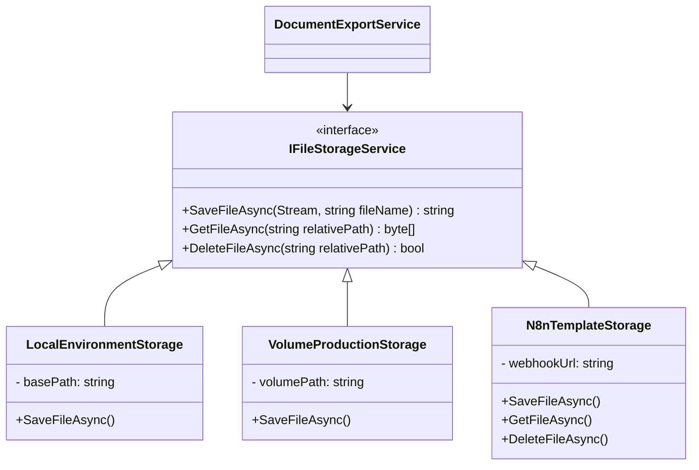

# Diseño Técnico y Arquitectura de Software

## 1. Diseño de Base de Datos (Entity Framework Core)

Se requiere una nueva entidad en el dominio: `AppTemplate`.

```csharp
public class AppTemplate : AuditableEntity // Hereda Id, CreatedAt, etc.
{
    public string Name { get; set; }
    public string Description { get; set; }
    public string TemplateType { get; set; } // Enum o String (Memoria, Certificado...)
    public string StoragePath { get; set; }  // Ruta/Key canónica devuelta por el proveedor de storage (n8n/local)
    public string OriginalFileName { get; set; }
    public string MimeType { get; set; }
    public long FileSizeBytes { get; set; }
    public bool IsActive { get; set; }
    public int Version { get; set; }
}
```

## 2. Patrón de Almacenamiento (Storage Provider Strategy)

Para cumplir con el entorno paramétrico y reducir riesgo de desalineación DB/FileStorage, utilizaremos un patrón Strategy configurado vía Inyección de Dependencias:

- `local` para desarrollo/local.
- `n8n` como estrategia recomendada en producción, delegando persistencia y recuperación a workflows.



## 3. Arquitectura del Motor de Exportación (Chain of Responsibility / Fallback)

El servicio de exportación debe decidir qué motor utilizar basándose en la disponibilidad de plantillas en la DB.


## 4. Integración con n8n (Webhooks)

* **Endpoint en n8n:** `POST https://n8n.tudominio.com/webhook/template-events`
* **Modo recomendado:** operación síncrona para `upload/get/delete` de plantillas.
* **Payload desde .NET:**

```json
{
  "event": "TEMPLATE_UPLOADED",
  "templateId": "uuid",
  "templateType": "MemoriaTécnica",
  "uploadedBy": "Admin",
  "timestamp": "2026-02-24T12:00:00Z"
}
```

### 4.1. Contrato recomendado para almacenamiento delegado

```json
{
    "operation": "UPLOAD_TEMPLATE",
    "templateType": "MemoriaTecnica",
    "fileName": "Plantilla_Memoria_v3.dotx",
    "mimeType": "application/vnd.openxmlformats-officedocument.wordprocessingml.template",
    "contentBase64": "...",
    "requestedBy": "admin@edificia.dev"
}
```

Respuesta esperada:

```json
{
    "success": true,
    "storageProvider": "s3",
    "storageKey": "templates/memoria/2026/02/plantilla-v3.dotx",
    "version": 3
}
```

## 5. Workflows sugeridos en n8n

1. **Auditoría:** Recibe el evento, notifica por Slack/Discord al equipo de calidad que hay una nueva versión de plantilla.  
2. **Distribución final:** Un endpoint en n8n que recibe un PDF/Word ya generado y orquesta el envío por correo al cliente final usando los datos de CRM.
