# 📦 IMPLEMENTACIÓN TÉCNICA

## Flujo de arquitectura

```mermaid
sequenceDiagram
    participant Astro as Cliente (Astro 4)
    participant API as .NET 10 API
  participant Cache as L1 Cache (IMemoryCache)
  participant N8N as n8n Template Storage
    
  Astro->>API: GET /api/projects/{id}/export
    API->>Cache: Obtener Plantilla (byte[])
    alt Cache Miss
    Cache->>N8N: GET_TEMPLATE (webhook síncrono)
    N8N-->>Cache: Retorna byte[]
        Cache-->>Cache: Guardar en MemoryCache
    end
    Cache-->>API: Retorna byte[]
    Note over API: RecyclableMemoryStream<br/>Render OpenXML SDK<br/>Inyección SdtElement<br/>Set UpdateFieldsOnOpen
    API-->>Astro: FileContentResult (application/vnd.openxmlformats...)
```



  ## 🧭 Resumen de la Solución Arquitectónica

  - **Recursos Controlados 🛡️:** La ejecución del servicio de exportación se despliega con límites de memoria estrictos (ej. 1536M para la API) y `Server GC` habilitado (`DOTNET_gcServer=1`). Esto reduce la fragmentación y mejora el rendimiento de recolección de basura en entornos KVM con recursos limitados.

  - **Caché L1 en memoria ♻️:** La caché de plantillas utiliza `IMemoryCache` con TTL para reducir latencia en lecturas repetidas. Redis L2 queda como optimización futura, no como requisito inicial.

  - **RecyclableMemoryStream 🔁:** Para prevenir la fragmentación de la LOH (Large Object Heap) y evitar que la generación de documentos pesados fracture la memoria del KVM (VPS con ~2GB), se usa `RecyclableMemoryStreamManager`. Esto convierte la asignación temporal de grandes buffers en un pool reciclable, mejorando la latencia y permitiendo escalado concurrente de múltiples generaciones.

  - **Herencia estricta de `SdtElement` / Pixel-Perfect Styling 🎯:** La manipulación se hace a bajo nivel sobre la estructura SAX/DOM de OpenXML evitando reescribir estilos. En lugar de reconstruir `Run`/`Paragraph` completos, la implementación respeta y preserva los `StyleId` y `w:rPr` originales presentes en el `.dotx` del arquitecto técnico. Esto garantiza que las salidas mantengan el layout y estilos aprobados sin necesidad de retoques manuales posteriores.

  - **Auto-TOC: actualización de campos al abrir 📚➡️🔄:** Dado que OpenXML no recalcula índices paginados en servidor, inyectamos `UpdateFieldsOnOpen` en el `settings.xml` para que el cliente (Word) actualice el TOC en la primera apertura. Es una solución práctica que evita cálculos de paginación complejos en servidor y mantiene el tamaño del binario razonable.


  ### Recomendaciones operativas

  - Limitar el número concurrente de exportaciones por instancia (p. ej. semáforo asincrónico con contador configurable) para mantener el uso de memoria dentro del presupuesto asignado.
  - Usar `CancellationToken` y timeouts agresivos en operaciones I/O y generación para liberar recursos rápidamente en caso de cargas anómalas.
  - Ofrecer un fallback a generación en background (cola / job) para exportaciones que excedan umbrales de recursos o tiempos de espera, devolviendo un enlace de descarga cuando el job termine.

## Servicio de Exportación XML

```csharp
using DocumentFormat.OpenXml.Packaging;
using DocumentFormat.OpenXml.Wordprocessing;
using Microsoft.IO;
using Microsoft.Extensions.Caching.Memory;
using System.IO;
using System.Linq;

namespace Edificia.Application.Export
{
    public interface ITemplateProvider
    {
        Task<byte[]> GetTemplateAsync(string templateName, CancellationToken cancellationToken);
    }

    public class DocumentExportService
    {
        private readonly ITemplateProvider _templateProvider;
        // Pool de memoria para evitar fragmentación de LOH en VPS con poca RAM
        private readonly RecyclableMemoryStreamManager _memoryStreamManager;

        public DocumentExportService(ITemplateProvider templateProvider)
        {
            _templateProvider = templateProvider;
            _memoryStreamManager = new RecyclableMemoryStreamManager();
        }

        public async Task<byte[]> GenerateReportAsync(string templateName, Dictionary<string, string> data, CancellationToken ct)
        {
            // 1. Obtener el binario del .dotx (desde Caché L1 o proveedor de storage)
            byte[] templateBytes = await _templateProvider.GetTemplateAsync(templateName, ct);

            // 2. Usar RecyclableMemoryStream para eficiencia
            using var stream = _memoryStreamManager.GetStream("ReportGeneration");
            await stream.WriteAsync(templateBytes, 0, templateBytes.Length, ct);
            stream.Position = 0;

            // 3. Abrir el documento manipulando el stream en memoria
            using (var document = WordprocessingDocument.Open(stream, true))
            {
                // Cambiar el tipo de documento de Plantilla (.dotx) a Documento (.docx)
                document.ChangeDocumentType(DocumentFormat.OpenXml.WordprocessingDocumentType.Document);

                var mainPart = document.MainDocumentPart;
                if (mainPart != null)
                {
                    // 4. Mapeo de Controles de Contenido (Pixel-Perfect Styling)
                    BindContentControls(mainPart, data);

                    // 5. Forzar actualización del Índice (TOC) al abrir
                    ForceUpdateFields(mainPart);
                }
                
                document.Save();
            }

            return stream.ToArray();
        }

        private void BindContentControls(MainDocumentPart mainPart, Dictionary<string, string> data)
        {
            // Buscar todos los SdtElement (Controles de contenido)
            var sdtElements = mainPart.Document.Body.Descendants<SdtElement>().ToList();

            foreach (var sdt in sdtElements)
            {
                // Obtener el Tag del control de contenido
                var tag = sdt.SdtProperties?.GetFirstChild<Tag>()?.Val?.Value;

                if (!string.IsNullOrEmpty(tag) && data.TryGetValue(tag, out string replacementText))
                {
                    // Obtener el nodo de contenido donde reside el texto
                    var sdtContent = sdt.GetFirstChild<SdtContentRun>();
                    if (sdtContent != null)
                    {
                        // Encontrar el Run y cambiar solo el texto, manteniendo el RunProperties (w:rPr)
                        var textNode = sdtContent.Descendants<Text>().FirstOrDefault();
                        if (textNode != null)
                        {
                            textNode.Text = replacementText;
                        }
                    }
                }
            }
        }

        private void ForceUpdateFields(MainDocumentPart mainPart)
        {
            var settingsPart = mainPart.DocumentSettingsPart;
            if (settingsPart == null) return;

            var updateFields = new UpdateFieldsOnOpen { Val = new DocumentFormat.OpenXml.OnOffValue(true) };
            settingsPart.Settings.Append(updateFields);
            settingsPart.Settings.Save();
        }
    }
}
```
---

## Configuración recomendada (n8n como storage delegado)

```yaml
version: '3.8'

services:
  api:
    build:
      context: ./apps/api
      dockerfile: Dockerfile
    environment:
      - DOTNET_Environment=Production
      - DOTNET_gcServer=1 # Habilitar Server GC para mejor rendimiento en KVM
      - ConnectionStrings__DefaultConnection=Host=postgres;Database=edificia;Username=postgres;Password=${POSTGRES_PASSWORD}
      - TemplateStorage__Provider=n8n
      - TemplateStorage__N8nWebhookUrl=${TEMPLATE_STORAGE_N8N_WEBHOOK_URL}
      - TemplateStorage__N8nApiSecret=${TEMPLATE_STORAGE_N8N_API_SECRET}
      - TemplateStorage__TimeoutSeconds=60
    depends_on:
      - postgres
    restart: unless-stopped
    # Limitación estricta para VPS KVM 2 (Ej. 1.5GB Max para la API)
    deploy:
      resources:
        limits:
          memory: 1536M
        reservations:
          memory: 512M

```